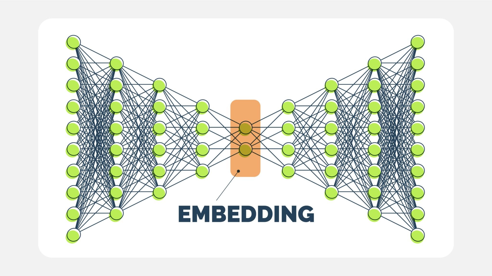

全连接神经网络（也常被称为多层感知机 MLP, Multi-Layer Perceptron）是深度学习中最基础、最核心的架构。它是卷积神经网络 (CNN) 和 Transformer 等复杂模型的基础组件。

-----

### 1\. 什么是全连接神经网络？

全连接神经网络是一种模仿生物神经元连接方式的数学模型。
**“全连接” (Fully Connected)** 的含义是：**第 $N$ 层的每一个神经元，都与第 $N+1$ 层的所有神经元相连**。

这种连接方式使得网络能够整合输入层的所有特征信息，通过权重的组合来提取复杂的特征。



-----

### 2\. 核心架构拆解

一个典型的全连接网络由三部分组成：

#### A. 输入层 (Input Layer)

  * **作用**：接收原始数据（如图像的像素值、文本的向量表示）。
  * **维度**：取决于特征的数量。例如，一张 $28 \times 28$ 的灰度图片，输入层就有 $784$ 个节点。

#### B. 隐藏层 (Hidden Layers)

  * **作用**：这是网络的“黑盒”部分，负责进行特征提取和变换。
  * **深度**：可以是多层（Deep Neural Network）。层数越多，理论上能拟合的函数越复杂。
  * **神经元**：每个神经元是一个计算单元。

#### C. 输出层 (Output Layer)

  * **作用**：输出最终预测结果。
  * **形式**：
      * **回归问题**：输出一个连续数值（如房价预测）。
      * **分类问题**：输出各个类别的概率（如手写数字识别）。

-----

### 3\. 单个神经元的数学原理

全连接网络的最小单元是神经元（Perceptron）。它的计算过程分为两步：**线性变换** 和 **非线性激活**。

对于某个神经元，假设输入向量为 $x$，权重向量为 $w$，偏置为 $b$：

#### 第一步：线性加权求和

$$z = \sum_{i=1}^{n} w_i x_i + b = w^T x + b$$

  * **直观理解**：这就是一个线性回归公式。它衡量输入信号的重要性。

#### 第二步：非线性激活 (Activation)

$$y = \sigma(z)$$

  * 这里 $\sigma$ 是激活函数。
  * **为什么需要这一步？** 如果没有激活函数，无论网络有多少层，最终都只是线性变换的叠加（$W_2(W_1x) = W_{new}x$），网络将无法解决非线性问题（如 XOR 问题或复杂的图像识别）。

-----

### 4\. 关键组件：激活函数 (Activation Functions)

激活函数赋予了神经网络“非线性”的能力，使其成为通用函数近似器。

  * **Sigmoid / Tanh**:
      * **特点**：将输出压缩到 $(0,1)$ 或 $(-1,1)$ 之间。
      * **缺点**：容易出现**梯度消失 (Gradient Vanishing)** 问题，导致深层网络无法训练。现在主要用于二分类的输出层。
  * **ReLU (Rectified Linear Unit)**:
      * **公式**：$f(x) = \max(0, x)$
      * **特点**：计算极快，解决了梯度消失问题（正区间梯度恒为1）。
      * **地位**：目前隐藏层的**首选**激活函数。
  * **Softmax**:
      * **特点**：将多个输出转换为概率分布，且概率之和为1。
      * **用途**：多分类问题的输出层。

-----

### 5\. 网络的训练机制 (怎么让它变聪明？)

神经网络并不是一开始就知道答案的，它需要通过**训练**来调整权重矩阵 $W$ 和偏置 $b$。这个过程包含三个核心步骤：

#### Step 1: 前向传播 (Forward Propagation)

数据从输入层经过层层计算，最后得到预测值 $\hat{y}$。

#### Step 2: 计算损失 (Loss Calculation)

使用损失函数衡量预测值 $\hat{y}$ 和真实标签 $y$ 之间的差距。

  * **均方误差 (MSE)**：用于回归任务。
    $$L = \frac{1}{N} \sum (\hat{y} - y)^2$$
  * **交叉熵损失 (Cross Entropy)**：用于分类任务。
    $$L = - \sum y \log(\hat{y})$$

#### Step 3: 反向传播 (Backpropagation) —— 核心中的核心

这是神经网络学习的关键。通过**链式法则 (Chain Rule)**，计算损失函数 $L$ 对每个权重 $w$ 的梯度：
$$\frac{\partial L}{\partial w}$$
这就告诉了网络：**为了减少错误，这个权重应该变大一点还是变小一点？**

然后使用**梯度下降 (Gradient Descent)** 更新权重：
$$w_{new} = w_{old} - \eta \cdot \frac{\partial L}{\partial w}$$
*(其中 $\eta$ 是学习率，Learning Rate)*

-----

### 6\. 全连接网络的优缺点分析

| 特性 | 描述 |
| :--- | :--- |
| **优点** | 1. **通用性强**：理论上可以拟合任何函数（通用近似定理）。<br>2. **适用性广**：可用于表格数据、简单的分类/回归任务。 |
| **缺点** | 1. **参数量爆炸**：处理高维数据（如大图像）时，参数极其庞大，导致计算慢且易过拟合。<br>2. **丢失空间/时间结构**：它将图像拉平成一维向量，破坏了像素间的空间相邻关系（这也是为什么图像处理首选 CNN 的原因）。 |

-----

### 7\. 代码示例 (PyTorch)

这是一个标准的 3 层全连接神经网络的代码结构：

```python
import torch
import torch.nn as nn
import torch.nn.functional as F

class SimpleFCNN(nn.Module):
    def __init__(self, input_size, hidden_size, num_classes):
        super(SimpleFCNN, self).__init__()
        # 第一层：输入 -> 隐藏层
        self.fc1 = nn.Linear(input_size, hidden_size)
        # 第二层：隐藏层 -> 隐藏层 (可选，增加深度)
        self.fc2 = nn.Linear(hidden_size, hidden_size)
        # 第三层：隐藏层 -> 输出层
        self.fc3 = nn.Linear(hidden_size, num_classes)
        
    def forward(self, x):
        # 1. 输入数据经过第一层 + ReLU激活
        out = F.relu(self.fc1(x))
        # 2. 经过第二层 + ReLU激活
        out = F.relu(self.fc2(out))
        # 3. 经过输出层 (如果是分类任务，通常由Loss函数处理Softmax)
        out = self.fc3(out)
        return out

# 示例：定义一个处理 28x28 图片(784特征)的网络，分类10个数字
model = SimpleFCNN(input_size=784, hidden_size=128, num_classes=10)
print(model)
```

-----
