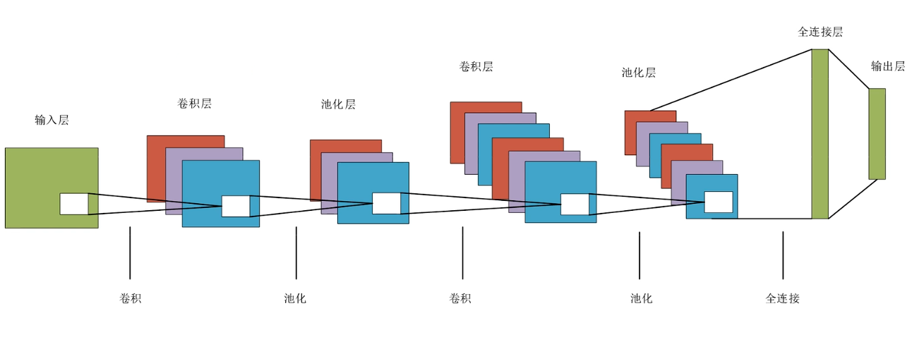

如果说全连接网络 (FCNN) 是“通才”，那么 CNN 就是**视觉领域的“专家”**。它几乎统治了计算机视觉领域，从人脸识别到自动驾驶，核心都是 CNN。

-----

### 1\. 为什么我们需要 CNN？(FCNN 的局限性)

在 CNN 出现之前，我们尝试用全连接网络处理图像，但遇到了两个致命问题：

1.  **参数量爆炸**：
      * 假设一张普通的彩图 $1000 \times 1000 \times 3$ (300万像素)。
      * 如果连接到下一层（仅1000个神经元），参数量就是 $300万 \times 1000 = 30亿$ 个权重！这根本无法训练。
2.  **丢失空间特征**：
      * 全连接层必须把图像“拉平”成一条长向量。
      * 这导致像素之间的空间关系（比如眼睛在鼻子上面）完全丢失了。

**CNN 的解决方案**：它不再把图像拉平，而是保留图像的 2D/3D 结构，像人眼扫描一样去提取特征。



-----

### 2\. CNN 的三大核心组件

一个典型的 CNN 就像一条流水线，主要由以下三种积木搭建而成：

#### A. 卷积层 (Convolutional Layer) —— 提取特征的“眼睛”

这是 CNN 的灵魂。它不全连接，而是**局部连接**。

  * **卷积核 (Kernel/Filter)**：
    想象一个 $3 \times 3$ 的小窗口（手电筒）。它在图像上滑动，每次只看一小块区域。
  * **计算过程**：
    窗口内的像素值与卷积核的权重做**点积**（对应位置相乘再相加的到的标量）。
  * **权值共享 (Weight Sharing)**：
    这是 CNN 最天才的设计。**不管扫描图像的左上角还是右下角，我们都用同一个过滤器（卷积核）。** 这大大减少了参数量。
  * **作用**：
    不同的卷积核负责提取不同的特征。
      * 浅层卷积核：提取边缘、线条、颜色。
      * 深层卷积核：提取形状、纹理、甚至具体的物体部件（如猫的耳朵）。

#### B. 池化层 (Pooling Layer) —— 压缩信息的“漏斗”

也叫下采样 (Downsampling)。

  * **作用**：
    1.  **减小尺寸**：减少后续计算量。
    2.  **特征不变性**：只要猫在画面里，不管它向左移一点还是向右移一点，池化后的结果基本不变（鲁棒性）。
  * **常用方法**：
      * **最大池化 (Max Pooling)**：只保留窗口内最大的数值（最显著的特征）。
      * 平均池化 (Average Pooling)：保留平均值。


#### C. 全连接层 (Fully Connected Layer) —— 最后的“决策者”

  * **位置**：通常在网络的最后几层。
  * **作用**：经过前面多层卷积和池化，图像已经被浓缩成了一组“高级特征向量”。全连接层负责根据这些特征进行分类（比如：这是猫的概率是 90%）。

-----

### 3\. CNN 的完整工作流程

假设我们要识别一张图片是不是“猫”：

1.  **Input**: 原始像素矩阵。
2.  **Conv1 + ReLU**: 发现了很多线条和边缘。
3.  **Pool1**: 图片变小了，去掉了不重要的细节。
4.  **Conv2 + ReLU**: 线条组合成了形状（圆形、尖角）。
5.  **Pool2**: 图片继续变小，特征更加抽象。
6.  **Conv3**: 形状组合成了部件（猫眼、猫耳）。
7.  **Flatten**: 把立体的特征图拉平。
8.  **FC Output**: 综合判断——有猫眼、有猫耳、有毛发 $\rightarrow$ 它是猫。

-----

### 4\. 代码示例 (PyTorch)

这是一个经典的 CNN 结构（类似 LeNet/AlexNet 的简化版），用于处理 MNIST 或 CIFAR-10 图片：

```python
import torch
import torch.nn as nn
import torch.nn.functional as F

class SimpleCNN(nn.Module):
    def __init__(self, num_classes=10):
        super(SimpleCNN, self).__init__()
        
        # 1. 卷积块 1
        # 输入: [Batch, 3, 32, 32] (假设是3通道彩色图)
        # 卷积: 输出通道16, 核大小3x3, 步长1, 填充1 -> 保持宽高不变
        self.conv1 = nn.Conv2d(in_channels=3, out_channels=16, kernel_size=3, padding=1)
        # 池化: 2x2最大池化 -> 宽高减半 [Batch, 16, 16, 16]
        self.pool = nn.MaxPool2d(kernel_size=2, stride=2)
        
        # 2. 卷积块 2
        # 输入: [Batch, 16, 16, 16]
        # 卷积: 输出通道32 -> [Batch, 32, 16, 16]
        self.conv2 = nn.Conv2d(in_channels=16, out_channels=32, kernel_size=3, padding=1)
        # 池化后变为: [Batch, 32, 8, 8]
        
        # 3. 全连接层
        # 输入维度需要计算: 32(通道) * 8(高) * 8(宽) = 2048
        self.fc1 = nn.Linear(32 * 8 * 8, 512)
        self.fc2 = nn.Linear(512, num_classes)
        
    def forward(self, x):
        # Block 1: Conv -> ReLU -> Pool
        x = self.pool(F.relu(self.conv1(x)))
        
        # Block 2: Conv -> ReLU -> Pool
        x = self.pool(F.relu(self.conv2(x)))
        
        # Flatten: 拉平，准备进入全连接层
        x = x.view(-1, 32 * 8 * 8) 
        
        # FC layers
        x = F.relu(self.fc1(x))
        x = self.fc2(x) # 输出层不需要激活，直接给Loss函数
        
        return x

# 实例化模型
model = SimpleCNN(num_classes=10)
# 打印看看结构
print(model)
```

-----

### 5\. 关键术语速查


  * **Stride (步长)**：卷积核每次移动几格？步长越大，输出图像越小。
  * **Padding (填充)**：在图片周围补一圈 0。为了保持图片尺寸不变，或者处理边缘像素。
  * **Channel (通道)**：图像的深度。
      * RGB 图片输入有 3 个通道。
      * 经过 64 个卷积核处理后，输出就有 64 个通道（也就是 64 张特征图 Feature Maps）。

-----
