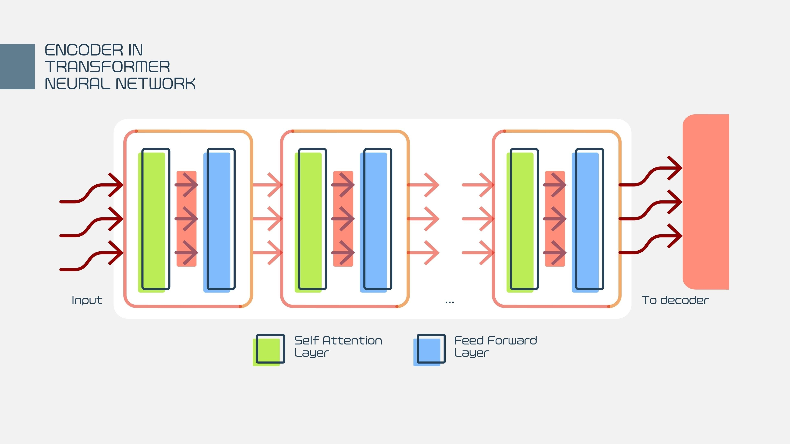

这是一部神经网络的“进化史”，也是深度学习从“实验室玩具”走向“工业界统治者”的宏大叙事。

这四个网络代表了深度学习发展的四个里程碑。它们的主旋律只有三个字：**更深了 (Going Deeper)**。

---

### 1. LeNet-5 (1998)：开山鼻祖
**地位**：它是 CNN 的“Hello World”，由深度学习三巨头之一 Yann LeCun 提出。
**背景**：当时主要用于银行支票上的手写数字识别。

* **核心贡献**：确立了 **卷积层 $\to$ 池化层 $\to$ 全连接层** 的标准骨架。
* **架构特点**：
    * 非常小，只有 5 层（2个卷积+3个全连接）。
    * 激活函数用的是 Sigmoid/Tanh（导致无法做得太深）。
    * 池化使用的是平均池化。
* **局限性**：受限于当时的算力，它只能处理 $28 \times 28$ 这种简单的黑白灰度图，无法处理复杂的高清彩色照片。

---

### 2. AlexNet (2012)：王者归来 (深度学习爆发的原点)
**地位**：沉寂了10年后，AlexNet 在 ImageNet 竞赛中以碾压性的优势夺冠，宣告了**深度学习时代**的到来。

* **核心变革**：
    1.  **更深**：扩展到了 8 层。
    2.  **ReLU 登场**：首次在深层网络中通过使用 **ReLU** 替代 Sigmoid，解决了梯度消失问题，大大加快了训练速度。
    3.  **Dropout**：引入 Dropout 层随机“关掉”部分神经元，防止过拟合。
    4.  **GPU 加速**：这是历史上第一个利用 GPU (显卡) 进行训练的大型网络，开启了 AI 的“算力暴力美学”。
* **影响**：它证明了 CNN 可以通过“加深”来提取极高维度的特征。

---

### 3. VGG (2014)：暴力美学的极致
**地位**：VGG (Visual Geometry Group) 是牛津大学提出的。它的特点是**结构极其规整**，像堆积木一样。

* **核心理念**：**用小卷积核堆叠替代大卷积核。**
    * AlexNet 用了很大的卷积核（如 $11 \times 11$），参数量巨大。
    * VGG 全部统一使用 **$3 \times 3$** 的微小卷积核。
* **为什么 $3 \times 3$ 更好？**
    * **感受野等效**：堆叠 2 个 $3 \times 3$ 卷积层，看到的区域（感受野）等于 1 个 $5 \times 5$；堆叠 3 个等于 1 个 $7 \times 7$。
    * **参数更少**：虽然层数多了，但参数量反而下降了。
    * **非线性更强**：层数多意味着经过了更多次 ReLU 激活，特征提取能力更强。
* **经典型号**：VGG-16 (16层) 和 VGG-19。
* **缺点**：虽然结构简单，但全连接层参数依然过多，模型文件非常大（500MB+）。

---

### 4. ResNet (2015)：残差网络 —— 颠覆性的里程碑
**地位**：由何恺明（Kaiming He）等人提出。它是现代深度学习的**基石**。在此之前，网络大概只能训练到 20 层左右；ResNet 一举将深度推到了 **152 层** 甚至上千层，且性能不降反升。

#### 核心问题：退化现象 (Degradation)
在 ResNet 出现前，人们发现：**当网络过深时（比如超过 20 层），效果反而变差了**。
这不仅仅是过拟合，而是**训练困难**。因为梯度在几十层反向传播中，要么消失（变0），要么爆炸（变无穷大），导致前面的层根本学不到东西。

#### 解决方案：残差块 (Residual Block) 与 跳跃连接 (Skip Connection)
ResNet 发明了一种“抄近道”的机制。

**原理通俗解释**：
假设输入是 $x$，普通的网络层试图学习一个复杂的函数 $H(x)$。
ResNet 引入了一条**跳跃连接（Shortcut）**，直接把 $x$ 传到了输出端。
那么中间的层只需要学习 **$F(x) = H(x) - x$**。
这里的 $F(x)$ 被称为**残差 (Residual)**。

**为什么这能解决问题？**
1.  **保底机制**：如果网络发现中间这几层不仅没用甚至还在帮倒忙，它可以把 $F(x)$ 的权重训练为 0。这样输出就变成了 $H(x) = 0 + x = x$。也就是说，**最差的情况也就是把上一层的特征原封不动地传下去**，至少不会比浅层网络更差。
2.  **梯度高速公路**：在反向传播时，梯度可以通过这条“捷径”毫无损耗地传回前面的层，彻底解决了梯度消失问题。

---

### 总结与对比

| 网络 | 年份 | 核心特点 | 深度 (层数) | 历史意义 |
| :--- | :--- | :--- | :--- | :--- |
| **LeNet** | 1998 | 卷积+池化雏形 | 5 | 验证了 CNN 的可行性。 |
| **AlexNet** | 2012 | ReLU, Dropout, GPU | 8 | 开启深度学习热潮，ImageNet 冠军。 |
| **VGG** | 2014 | 全 $3 \times 3$ 小卷积核 | 16 / 19 | 证明了“深层小卷积”优于“浅层大卷积”。 |
| **ResNet** | 2015 | **跳跃连接 (Skip Connection)** | 50 / 101 / 152 | **解决了深层网络训练难题**，确立了超深网络的统治地位。 |

---

### 下一步建议

既然您特别关注 ResNet 且是博士生，理解 ResNet 的代码实现非常重要。它是目前绝大多数计算机视觉任务的 **Backbone（主干网络）**。

您希望我：
1.  **代码实战**：用 PyTorch 手写一个简单的 **Residual Block (残差块)**，看看那个“跳跃连接”在代码里究竟是一行什么样的代码？
2.  **深入应用**：了解基于 ResNet 改进的更强网络（如 DenseNet 或 MobileNet）？